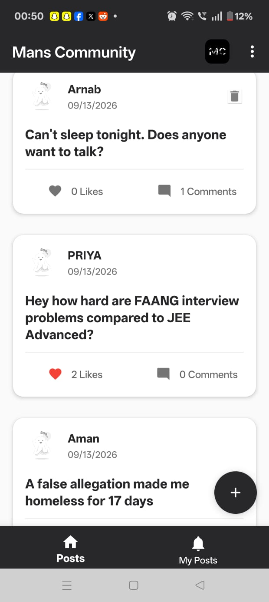
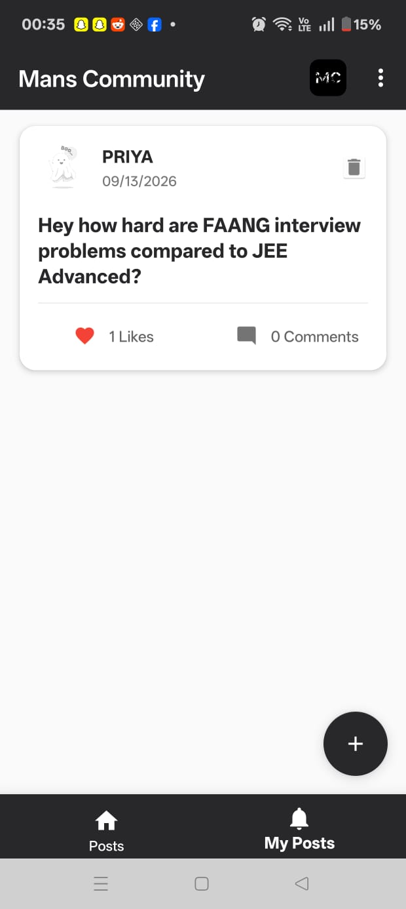
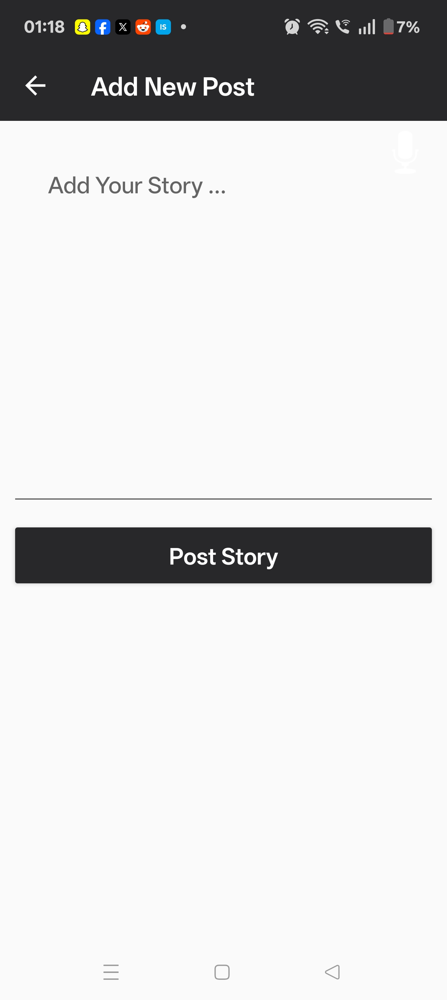
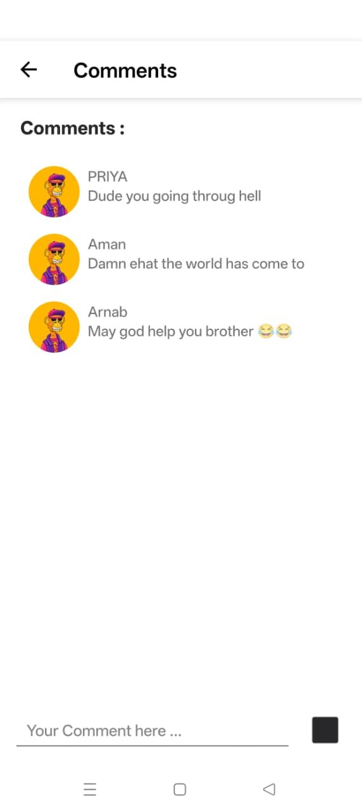
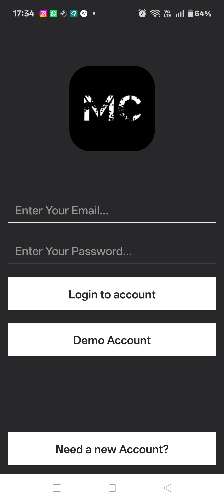

<div align="center">

# 💬 Chit Chat — Social Talking Application

### An Android community platform to connect, post, and engage — like Reddit, built for real-time conversation.

[](https://github.com/AmanKumar925/Chit-Chat-Talking-Application)
[](https://github.com/AmanKumar925/Chit-Chat-Talking-Application)
[](https://firebase.google.com/)
[](https://aws.amazon.com/s3/)
[](LICENSE)

</div>

---

## 📖 Overview

**Chit Chat** is a native Android community application that lets users create posts, comment, like, and interact with people across an open feed — similar in spirit to Reddit. It combines **social feed interactions** with **secure authentication and cloud infrastructure**, built entirely in **Java** using **Android Studio**.

The app is designed around a scalable Firebase backend paired with Amazon S3 for media storage, giving it a production-style architecture rather than a toy demo.

---

## ✨ Key Features

- 🔐 **Secure Authentication** — Firebase Authentication for user sign-up/login
- 📝 **Create & Share Posts** — Users can publish text/media posts to a public community feed
- 💬 **Comment System** — Threaded commenting on any post
- ❤️ **Like / Engagement System** — Real-time like counts powered by Firebase Realtime Database
- 🌐 **Open Community Feed** — Discover and interact with posts from any user, not just contacts
- ☁️ **Cloud Media Storage** — Images/media uploaded and served via Amazon S3
- 🔄 **Real-Time Sync** — Firestore + Realtime Database keep feeds, likes, and comments updated live across devices

---

## 🛠️ Tech Stack

| Layer | Technology |
|---|---|
| **Language** | Java |
| **IDE / Build** | Android Studio, Gradle |
| **Authentication** | Firebase Authentication |
| **Database** | Cloud Firestore, Firebase Realtime Database |
| **Media Storage** | Amazon S3 |
| **Architecture** | Android SDK (Activities/Fragments, RecyclerView-based feeds) |

---

## 📱 App Preview

<div align="center">

| Home Feed | Post Details | Create Post |
|:---:|:---:|:---:|
|  |  |  |

| Comments | Login / Auth |
|:---:|:---:|
|  |  |

</div>

> 📌 Screenshots live in a `/screenshots` folder in the repo root. Rename/update filenames and captions above to match your actual files.

---

## 🏗️ Architecture Highlights

- **Auth Layer:** Firebase Authentication handles secure sign-up/login and session management.
- **Data Layer:** Cloud Firestore stores structured post/comment data; Firebase Realtime Database drives live updates (likes, presence).
- **Media Layer:** User-uploaded images are stored on Amazon S3 and referenced via URL in Firestore documents — keeping the database lightweight and media delivery fast.
- **Presentation Layer:** Native Android UI built with Java, using RecyclerViews for scrollable feeds and comment threads.

---

## 🚀 Getting Started

### Prerequisites
- Android Studio (latest stable)
- JDK 8+
- A Firebase project (Authentication, Firestore, Realtime Database enabled)
- An AWS account with an S3 bucket configured for media storage

### Installation

```bash
# Clone the repository
git clone https://github.com/AmanKumar925/Chit-Chat-Talking-Application.git

# Open in Android Studio
# File > Open > select the cloned folder

# Add your own google-services.json (Firebase config) to /app

# Configure your AWS S3 credentials/bucket in the relevant config file

# Build and run on an emulator or physical device
```

---

## 🎯 What This Project Demonstrates

- Designing and implementing a **multi-service cloud architecture** (Firebase + AWS) on a single mobile app
- Building **real-time, socially-interactive features** (feeds, likes, comments) with live data sync
- Handling **authentication and secure user sessions** on Android
- Structuring a **scalable Android codebase** in Java following clean component separation

---

## 📬 Contact

**Aman Kumar**
📧 Feel free to reach out via [GitHub](https://github.com/AmanKumar925)

---

<div align="center">

⭐ If you found this project interesting, consider giving it a star!

</div>
